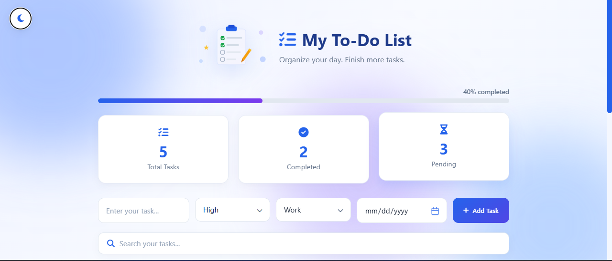

# 📝 Smart To-Do List — Productivity Task Manager

A modern, feature-rich task management web application built with **vanilla HTML, CSS, and JavaScript** — no frameworks, just clean fundamentals.

🔗 **Live Demo:** [Add your deployed link here]
💻 **Repo:** [ https://github.com/laiba-012/smart-todo-app]




---

## ✨ Features

- ✅ **Full CRUD** — Add, Edit, Delete, and Complete tasks
- 🔍 **Real-time Search** — instantly filter tasks as you type
- 🗂️ **Filter & Categories** — filter by status (All / Pending / Completed) and category (Work / Study / Personal)
- 📌 **Pin Tasks** — keep important tasks pinned to the top
- 🖐️ **Drag & Drop Reordering** — reorder tasks manually
- 🌙 **Dark / Light Mode** — theme preference saved automatically
- 📊 **Dynamic Progress Bar & Stats** — live completion percentage and task counts
- ⏰ **Due Date Alerts** — overdue and due-today tasks are flagged automatically
- 💾 **Local Storage Persistence** — tasks are saved in the browser, no backend required
- 🔔 **Toast Notifications** — with an Undo option for deleted tasks
- 📤 **Export to CSV & PDF** — download your task list for reporting or backup
- ✅ **Form Validation** — prevents empty or invalid task entries
- 📱 **Fully Responsive** — works smoothly on mobile, tablet, and desktop
- ⌨️ **Keyboard Shortcuts** — `/` to search, `Esc` to cancel/clear

---

## 🛠️ Tech Stack

- **HTML5** — semantic structure
- **CSS3** — custom properties, Flexbox, animations, responsive design
- **JavaScript (ES6+)** — DOM manipulation, state management, event delegation
- **Font Awesome** — icons
- **jsPDF** — client-side PDF generation

No frameworks or build tools — built entirely with core web fundamentals.

---

## 🚀 How to Run Locally

1. Clone this repository
   ```bash
   git clone https://github.com/laiba-012/smart-todo-app.git
   ```
2. Open `index.html` in your browser — that's it, no installation needed.

---

## 📂 Project Structure

```
smart-todo-app/
├── index.html      # Markup & structure
├── style.css       # Styling, themes, and animations
├── script.js       # App logic and state management
└── README.md
```


## 🎯 What I Learned

Building this project helped me practice:
- Managing complex application state without a framework
- LocalStorage for data persistence
- Building accessible, reusable UI patterns (toasts, modals, dropdowns)
- Implementing drag-and-drop with the native HTML5 Drag and Drop API
- Generating client-side PDF/CSV exports
- Writing clean, maintainable, well-commented JavaScript

---

## 📬 Contact

Name:Laiba Fatima
[LinkedIn](www.linkedin.com/in/laiba-fatima-7760b1325) • [GitHub](https://github.com/laiba-012) 
 [Email](laibafatima0116@gmail.com)